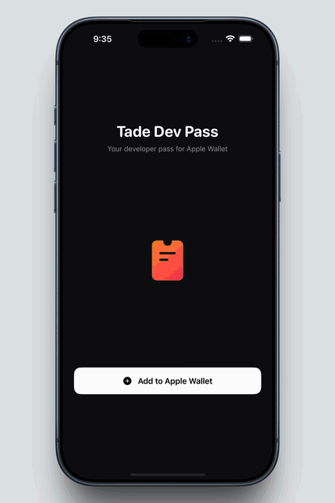

# WalletDemo

A tiny SwiftUI iOS app that demonstrates adding a `.pkpass` to Apple Wallet using PassKit.

Tap **Add to Apple Wallet**, PassKit renders the pass preview, confirm, and it lands in your Wallet.

## Demos

### 1. Adding a pass to Apple Wallet

The full flow from tapping the button to the pass appearing in Wallet.

### 2. Passes in my Apple Wallet

A look at the passes I've collected in Wallet.

> Prefer the original recordings (with audio)? They're in [`media/`](./media) as `.mp4`.

## How it works

- [`ContentView.swift`](./WalletDemo/ContentView.swift) — the UI: a dark screen with a wallet icon and an "Add to Apple Wallet" button.
- [`AddPassView.swift`](./WalletDemo/AddPassView.swift) — a `UIViewControllerRepresentable` wrapping `PKAddPassesViewController` so the SwiftUI layer can present the native Wallet sheet.
- `TadeDevPass.pkpass` lives in the app bundle and is loaded via `PKPass(data:)` before being handed to `PKAddPassesViewController`.

## Requirements

- Xcode 15+
- iOS 17+ device or simulator (the Wallet sheet works in the simulator; actually storing passes requires a real device)

## Run it

1. Open `WalletDemo.xcodeproj` in Xcode.
2. Select a simulator or your device.
3. Build & run (`⌘R`).
4. Tap **Add to Apple Wallet**.
